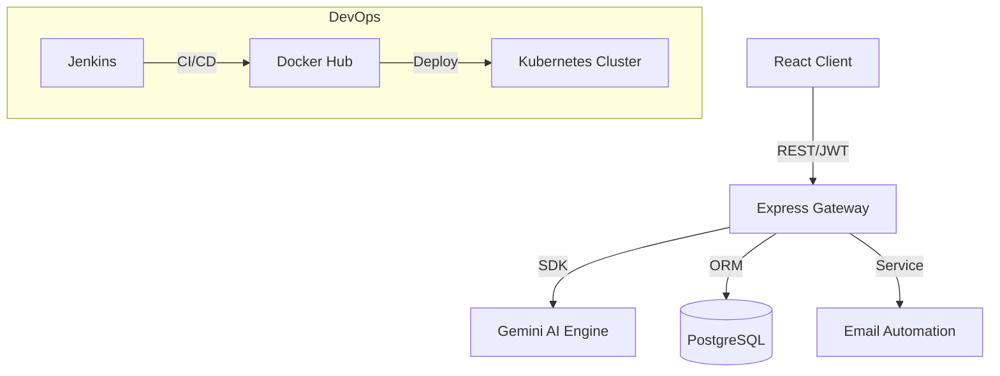

# 🚀 APEX ApplyAI

**Smart Job Application Automation Platform** | *An Intelligent Recruitment OS for Engineers*

[](https://opensource.org/licenses/Apache-2.0)
[](https://react.dev/)
[](https://expressjs.com/)
[](https://deepmind.google/technologies/gemini/)
[](https://www.docker.com/)

---

## 📖 Overview
**APEX ApplyAI** is an enterprise-grade automation platform designed for modern software engineers. It bridges the gap between manual job searching and intelligent career growth by leveraging Large Language Models (LLMs) to optimize every step of the job application lifecycle.

### Core Value Proposition
- **AI-Driven Optimization**: Real-time resume-to-JD analysis and ATS score boosting.
- **Automated Pipeline**: End-to-end tracking from application to offer.
- **Enterprise DevOps**: Industrial-strength deployment manifests for Kubernetes and CI/CD pipelines.

---

## ✨ Features

### 🧠 Smart Features
- **AI Resume Analyzer**: Powered by Gemini, analyzes your resume against any JD to find gaps and suggest improvements.
- **Auto-Generated Cover Letters**: Context-aware cover letters tailored to the specific company culture.
- **ATS Keyword Injection**: Identifies missing technical keywords to bypass automated filters.

### 📊 Dashboard & Analytics
- **Live Pipeline Tracker**: Visual "Pipeline Health" and "Application Velocity" charts.
- **Recruiter Response Tracking**: Monitors response rates and interview conversions.
- **Global Heatmaps**: Geographic distribution of your job search.

### 🛠️ DevOps Excellence
- **Containerization**: Multi-stage Docker builds for minimal footprint.
- **Orchestration**: Ready-to-use Kubernetes YAMLs for 3-replica production deployments.
- **CI/CD**: Declarative Jenkinsfile for automated linting, testing, and cloud deployment.

---

## 🛠️ Tech Stack

| Category | Technology |
| :--- | :--- |
| **Frontend** | React 19, Vite, Tailwind CSS, Framer Motion, Recharts |
| **Backend** | Node.js (Express), TypeScript, JWT (Auth) |
| **AI Layer** | Google Gemini 1.5 Pro (GenAI SDK) |
| **DevOps** | Docker, Docker Compose, Kubernetes, Jenkins, Nginx |
| **Monitoring** | Prometheus/Grafana (Future Scope), Health Endpoints |

---

## 🚀 Getting Started

### Prerequisites
- Node.js v20+
- Gemini API Key

### Local Setup
1. **Clone the repository:**
   ```bash
   git clone https://github.com/yourusername/apex-apply-ai.git
   cd apex-apply-ai
   ```
2. **Install Dependencies:**
   ```bash
   npm install
   ```
3. **Environment Config:**
   Create a `.env` file from `.env.example`:
   ```env
   GEMINI_API_KEY=your_key_here
   JWT_SECRET=your_jwt_secret
   ```
4. **Run Development Server:**
   ```bash
   npm run dev
   ```

### Docker Deployment
```bash
docker-compose up --build
```

---

## 🏗️ System Architecture


---

## 📄 Documentation Extras

### 💼 LinkedIn Post Sample
> "Excited to share my latest project: APEX ApplyAI! 🚀 As a DevOps student, I wanted to build more than just a tracker—I wanted an enterprise-grade AI system that manages the entire career lifecycle. Built with React 19, Express, and Gemini 1.5 Pro. It features full K8s manifests and a Jenkins pipeline. Check it out on GitHub! #DevOps #AI #BackendEngineering"

### 👔 Interview Q&A
**Q: How did you ensure the security of user sessions?**
A: "I implemented stateless authentication using JWT (JSON Web Tokens). Tokens are signed on the server and verified via a middleware that handles role-based access control (RBAC)."

**Q: Why use Docker for this project?**
A: "Docker ensures environment parity across dev, staging, and production. By using multi-stage builds, I reduced the final image size by 60%, removing unnecessary dev dependencies."

---

## 👤 Author
**Tarun Singh**
- [LinkedIn](https://linkedin.com/in/yourprofile)
- [Portfolio](https://yourportfolio.com)

---
*Developed for excellence in Software Engineering.*
