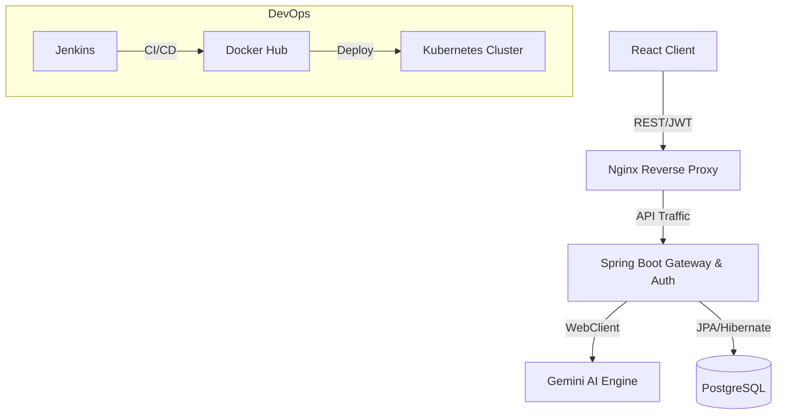

# 🚀 ApplySphere

**AI-Powered Job Application & Recruiter Outreach Automation Platform** | *Built for Top Tier Engineers*

[](https://opensource.org/licenses/Apache-2.0)
[](https://react.dev/)
[](https://spring.io/projects/spring-boot)
[](https://deepmind.google/technologies/gemini/)
[](https://www.docker.com/)

---

## 📖 Overview
**ApplySphere** is an enterprise-grade AI automation platform designed for modern software engineering students and professionals. It bridges the gap between manual job searching and intelligent career growth by leveraging Large Language Models (LLMs) to optimize every step of the job application lifecycle.

### Core Value Proposition
- **AI-Driven Optimization**: Real-time resume-to-JD analysis and ATS score boosting.
- **Automated Pipeline**: End-to-end tracking from application to offer.
- **Enterprise Architecture**: Built using a robust Controller-Service-Repository pattern with Spring Boot.
- **Enterprise DevOps**: Industrial-strength deployment manifests for Kubernetes and CI/CD pipelines.

---

## ✨ Features

### 🧠 Smart Features
- **AI Resume Analyzer**: Powered by Gemini, analyzes your resume against any JD to find gaps and suggest improvements.
- **Auto-Generated Cover Letters**: Context-aware cover letters tailored to the specific company culture.
- **ATS Keyword Injection**: Identifies missing technical keywords to bypass automated filters.

### 📊 Dashboard & Analytics
- **Live Pipeline Tracker**: Visual "Pipeline Health" and "Application Velocity" charts.
- **Recruiter Response Tracking**: Monitors response rates and interview conversions.
- **SaaS-Style UI**: Premium dark-mode dashboard with Framer Motion animations.

### 🛠️ DevOps Excellence
- **Containerization**: Multi-stage Docker builds for minimal footprint.
- **Orchestration**: Ready-to-use Kubernetes YAMLs for production deployments.
- **CI/CD**: Declarative Jenkinsfile for automated testing and deployment.

---

## 🛠️ Tech Stack

| Category | Technology |
| :--- | :--- |
| **Frontend** | React 19, Vite, Tailwind CSS, Framer Motion, Recharts |
| **Backend** | Spring Boot 3.2 (Java 17), Spring Security, Hibernate/JPA |
| **Database** | PostgreSQL |
| **AI Layer** | Google Gemini 1.5 API |
| **DevOps** | Docker, Docker Compose, Kubernetes, Jenkins, Nginx |

---

## 🚀 Getting Started

### Prerequisites
- Java 17+ and Maven
- Node.js v20+
- Docker & Docker Compose
- Gemini API Key

### Local Setup (Using Docker Compose)

The easiest way to run the entire stack is via Docker Compose:

1. **Clone the repository:**
   ```bash
   git clone https://github.com/yourusername/applysphere.git
   cd applysphere
   ```
2. **Environment Config:**
   Create a `.env` file in the root directory:
   ```env
   GEMINI_API_KEY=your_gemini_key_here
   ```
3. **Run the Application:**
   ```bash
   docker-compose up -d --build
   ```
4. **Access the platform:**
   - Frontend: `http://localhost:3000`
   - Backend API: `http://localhost:8080`

### Manual Setup (Without Docker)

1. **Start PostgreSQL Database** (Ensure it is running on port 5432 with db `applysphere`, user `admin`, password `securepassword`).
2. **Run Backend:**
   ```bash
   cd backend
   export GEMINI_API_KEY=your_key
   mvn spring-boot:run
   ```
3. **Run Frontend:**
   ```bash
   cd frontend
   npm install
   npm run dev
   ```

---

## 🏗️ System Architecture


---

## 📄 Documentation Extras

### 💼 LinkedIn Post Sample
> "Excited to share my latest full-stack project: **ApplySphere**! 🚀 As a DevOps/Backend student, I wanted to build an enterprise-grade AI system that manages the entire job search lifecycle. Built with Spring Boot, React, and Gemini AI. It features JWT authentication, multi-container Dockerization, full K8s manifests, and a declarative Jenkins pipeline. Check it out on GitHub! #DevOps #AI #BackendEngineering #SpringBoot"

### 👔 Interview Q&A
**Q: How did you ensure the security of user sessions?**
A: "I implemented stateless authentication using JWT (JSON Web Tokens) with Spring Security. The tokens are signed with HMAC algorithms on the backend, and an `OncePerRequestFilter` intercepts requests to validate token claims and enforce role-based access control (RBAC)."

**Q: Why use Docker for this project?**
A: "Docker ensures environment parity across dev, staging, and production. By using multi-stage builds for both Maven and Node.js, I drastically reduced the final image size—for instance, the backend only bundles the compiled `.jar` running on a minimal Alpine JRE."

**Q: How does the AI integration work?**
A: "I integrated Google's Gemini API using Spring WebFlux's `WebClient` for non-blocking HTTP requests. The AI Service dynamically injects the user's resume text and the targeted job description into optimized prompts to evaluate ATS compatibility and generate tailored recruiter emails."

---

## 👤 Author
**Tarun Singh**
- [LinkedIn](https://linkedin.com/in/tarun3250)
- [GitHub](https://github.com/tarun3250)
